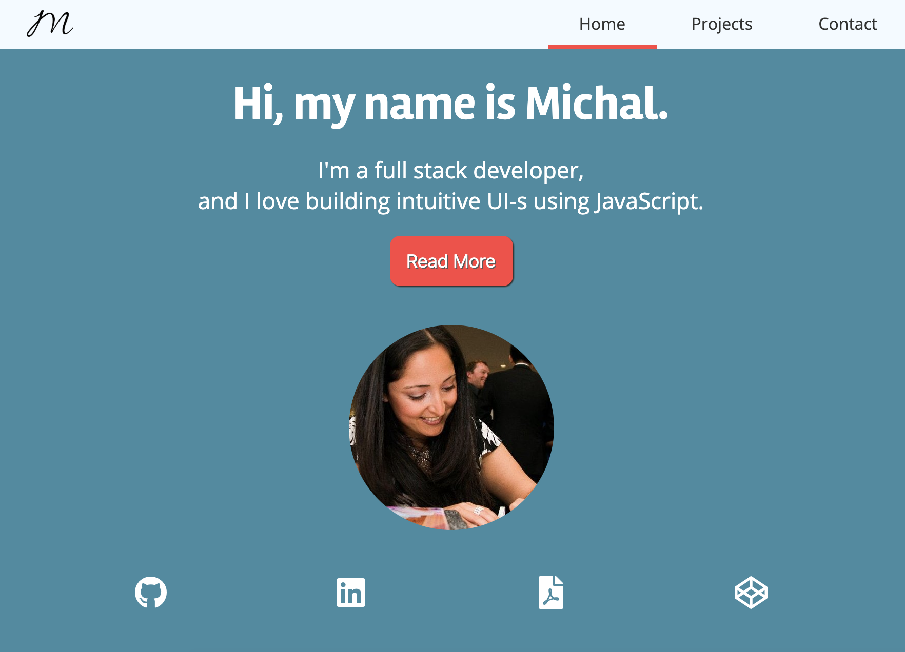
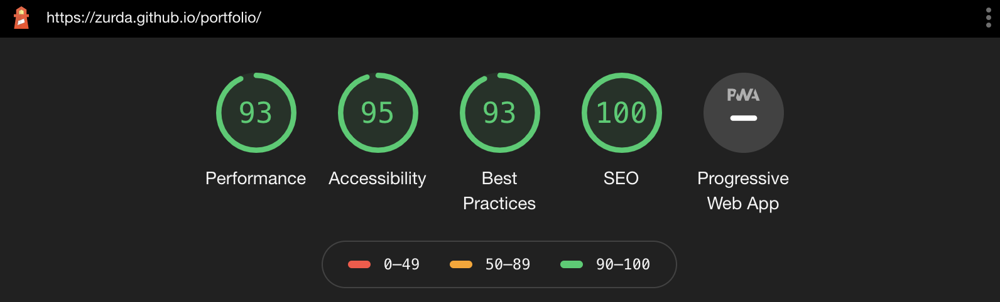
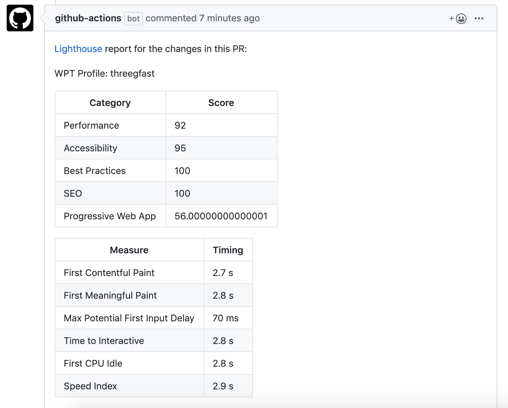

  

# My Portfolio 

<strong><a href="https://zurda.github.io/portfolio/">Here's the project link</a></strong>

## About this project 

This is project #3 for 2020. It's the first time I've chosed to do some maintanence on an existing project rather than start a new one. Initially it felt like cheating, but starting a new project is always more fun - so honestly, this was harder than you think. Reading my past self's code was really weird.

The project was created using `semantic HTML`, `css`, and `css grid`. I also used `gh-pages`, and Github Actions.

The main goal of this project was fiddling around with lighthouse audit: 

and Lighthouse audit actions on every PR: 

### Things I've learned 

- Adding lighthouse audits is really nice (there's really no reason for a simple website not to pass these audits, but it's still a good reminder if we accidentally miss something)
- Worth looking into how to run these lighthouse actions **after** a deploy. Otherwise we'll only find out about problems on the next PR. 
- Past me really liked `ID`s. Not sure why. Dear future me: please fix this! 🥺
- The page was set to deploy on every `gh-pages` branch update rather than master

### Still to do

- Swap out `ID`s with `Class`es
- Find a better way to display CV 
- Looking into lighthouse actions after deploying 

## Contributions

This project is absolutely accepting pull requests (first-timers welcome!). Feel free to report bugs and suggest features by opening a new issue. Check out the open 

This is it for now. See you on project #4 (I hope)
